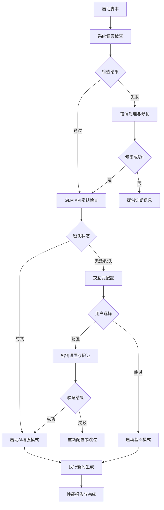

# 设计文档

## 概述

本设计文档描述了增强版 `start.py` 启动脚本的架构和实现方案。该脚本将提供智能的GLM API密钥检测与配置、全面的系统健康检查、交互式配置选项以及更好的错误处理和用户体验。

## 架构

### 核心模块架构

```
enhanced_start.py
├── ConfigManager (配置管理器)
│   ├── GLMKeyValidator (GLM密钥验证器)
│   ├── EnvironmentChecker (环境检查器)
│   └── InteractiveSetup (交互式设置)
├── SystemHealthChecker (系统健康检查器)
│   ├── DependencyChecker (依赖检查器)
│   ├── NetworkChecker (网络检查器)
│   └── FileSystemChecker (文件系统检查器)
├── ProgressTracker (进度跟踪器)
│   ├── ProgressBar (进度条)
│   └── PerformanceMonitor (性能监控)
└── ErrorHandler (错误处理器)
    ├── RecoveryManager (恢复管理器)
    └── DiagnosticReporter (诊断报告器)
```

### 数据流架构



## 组件和接口

### 1. ConfigManager (配置管理器)

**职责**: 管理所有配置相关的操作，包括GLM API密钥的检测、验证和设置。

**接口**:
```python
class ConfigManager:
    def __init__(self):
        self.glm_validator = GLMKeyValidator()
        self.env_checker = EnvironmentChecker()
        self.interactive_setup = InteractiveSetup()
    
    def check_glm_config(self) -> ConfigStatus
    def setup_glm_key_interactive(self) -> bool
    def validate_and_save_key(self, api_key: str) -> bool
    def get_config_sources(self) -> List[str]
```

**子组件**:

#### GLMKeyValidator
```python
class GLMKeyValidator:
    def validate_key_format(self, key: str) -> bool
    def test_api_connection(self, key: str) -> ValidationResult
    def get_key_info(self, key: str) -> KeyInfo
```

#### EnvironmentChecker
```python
class EnvironmentChecker:
    def check_env_variables(self) -> Dict[str, str]
    def check_config_files(self) -> List[str]
    def get_shell_type(self) -> str
```

#### InteractiveSetup
```python
class InteractiveSetup:
    def prompt_for_api_key(self) -> str
    def show_setup_options(self) -> SetupChoice
    def guide_manual_setup(self) -> None
    def confirm_configuration(self, config: Dict) -> bool
```

### 2. SystemHealthChecker (系统健康检查器)

**职责**: 执行全面的系统健康检查，包括依赖、网络和文件系统。

**接口**:
```python
class SystemHealthChecker:
    def __init__(self):
        self.dependency_checker = DependencyChecker()
        self.network_checker = NetworkChecker()
        self.filesystem_checker = FileSystemChecker()
    
    def run_full_check(self) -> HealthReport
    def run_quick_check(self) -> HealthReport
    def get_repair_suggestions(self, issues: List[Issue]) -> List[RepairAction]
```

**子组件**:

#### DependencyChecker
```python
class DependencyChecker:
    def check_python_version(self) -> CheckResult
    def check_required_packages(self) -> Dict[str, PackageStatus]
    def check_optional_packages(self) -> Dict[str, PackageStatus]
    def generate_install_commands(self, missing: List[str]) -> List[str]
```

#### NetworkChecker
```python
class NetworkChecker:
    def check_internet_connectivity(self) -> bool
    def check_api_endpoints(self) -> Dict[str, EndpointStatus]
    def diagnose_connection_issues(self) -> List[NetworkIssue]
    def suggest_network_fixes(self) -> List[str]
```

#### FileSystemChecker
```python
class FileSystemChecker:
    def check_required_directories(self) -> Dict[str, bool]
    def check_file_permissions(self) -> Dict[str, PermissionStatus]
    def check_disk_space(self) -> DiskSpaceInfo
    def create_missing_directories(self) -> bool
```

### 3. ProgressTracker (进度跟踪器)

**职责**: 提供用户友好的进度指示和性能监控。

**接口**:
```python
class ProgressTracker:
    def __init__(self):
        self.progress_bar = ProgressBar()
        self.performance_monitor = PerformanceMonitor()
    
    def start_operation(self, name: str, estimated_time: int) -> None
    def update_progress(self, percentage: float, message: str) -> None
    def complete_operation(self, success: bool, duration: float) -> None
    def get_performance_summary(self) -> PerformanceSummary
```

### 4. ErrorHandler (错误处理器)

**职责**: 处理各种错误情况，提供恢复选项和详细的诊断信息。

**接口**:
```python
class ErrorHandler:
    def __init__(self):
        self.recovery_manager = RecoveryManager()
        self.diagnostic_reporter = DiagnosticReporter()
    
    def handle_error(self, error: Exception, context: str) -> ErrorResponse
    def suggest_recovery_actions(self, error: Exception) -> List[RecoveryAction]
    def generate_diagnostic_report(self, error: Exception) -> DiagnosticReport
    def log_error_details(self, error: Exception, context: str) -> None
```

## 数据模型

### 配置状态模型
```python
@dataclass
class ConfigStatus:
    glm_key_present: bool
    glm_key_valid: bool
    config_source: str  # 'environment', 'file', 'none'
    key_info: Optional[KeyInfo]
    issues: List[str]

@dataclass
class KeyInfo:
    masked_key: str
    expiry_date: Optional[datetime]
    usage_quota: Optional[int]
    remaining_quota: Optional[int]
```

### 健康检查模型
```python
@dataclass
class HealthReport:
    overall_status: str  # 'healthy', 'warning', 'critical'
    dependency_status: Dict[str, PackageStatus]
    network_status: NetworkStatus
    filesystem_status: FileSystemStatus
    issues: List[Issue]
    repair_actions: List[RepairAction]

@dataclass
class Issue:
    severity: str  # 'info', 'warning', 'error', 'critical'
    category: str  # 'dependency', 'network', 'filesystem', 'config'
    message: str
    suggested_action: Optional[str]
```

### 进度跟踪模型
```python
@dataclass
class PerformanceSummary:
    total_duration: float
    operations: List[OperationMetrics]
    system_resources: ResourceUsage
    recommendations: List[str]

@dataclass
class OperationMetrics:
    name: str
    duration: float
    success: bool
    details: Dict[str, Any]
```

## 错误处理

### 错误分类和处理策略

1. **配置错误**
   - GLM API密钥无效/过期
   - 配置文件损坏
   - 环境变量设置错误
   - **处理**: 提供交互式修复选项，自动备份和恢复

2. **依赖错误**
   - Python包缺失
   - 版本不兼容
   - 安装权限问题
   - **处理**: 自动生成安装命令，提供多种安装方式

3. **网络错误**
   - 网络连接失败
   - API端点不可达
   - 超时错误
   - **处理**: 重试机制，离线模式建议，网络诊断

4. **文件系统错误**
   - 权限不足
   - 磁盘空间不足
   - 文件损坏
   - **处理**: 权限修复，空间清理建议，文件恢复

### 恢复策略

```python
class RecoveryStrategies:
    @staticmethod
    def recover_from_missing_dependencies():
        # 自动安装缺失依赖
        # 提供多种安装方式（pip, conda, 手动）
        pass
    
    @staticmethod
    def recover_from_network_issues():
        # 重试机制
        # 切换到离线模式
        # 提供网络诊断工具
        pass
    
    @staticmethod
    def recover_from_config_issues():
        # 重新生成配置文件
        # 交互式配置向导
        # 配置验证和修复
        pass
```

## 测试策略

### 单元测试
- 每个组件的独立功能测试
- 模拟各种错误情况
- 配置验证逻辑测试
- API密钥验证测试

### 集成测试
- 完整启动流程测试
- 错误恢复流程测试
- 用户交互流程测试
- 性能基准测试

### 用户验收测试
- 新用户首次设置体验
- 现有用户升级体验
- 错误情况下的用户体验
- 不同操作系统的兼容性测试

## 性能考虑

### 启动时间优化
- 延迟加载非关键组件
- 并行执行独立检查
- 缓存验证结果
- 智能跳过已验证的检查

### 内存使用优化
- 及时释放大型对象
- 使用生成器处理大数据
- 限制并发操作数量
- 监控内存使用情况

### 网络优化
- 连接池复用
- 请求超时设置
- 重试指数退避
- 离线模式支持

## 安全考虑

### API密钥安全
- 密钥在内存中的安全存储
- 日志中的密钥脱敏
- 配置文件权限控制
- 密钥传输加密

### 输入验证
- 用户输入的严格验证
- 防止注入攻击
- 文件路径验证
- 网络请求验证

### 错误信息安全
- 避免泄露敏感信息
- 错误消息的安全过滤
- 诊断报告的隐私保护
- 日志文件的访问控制